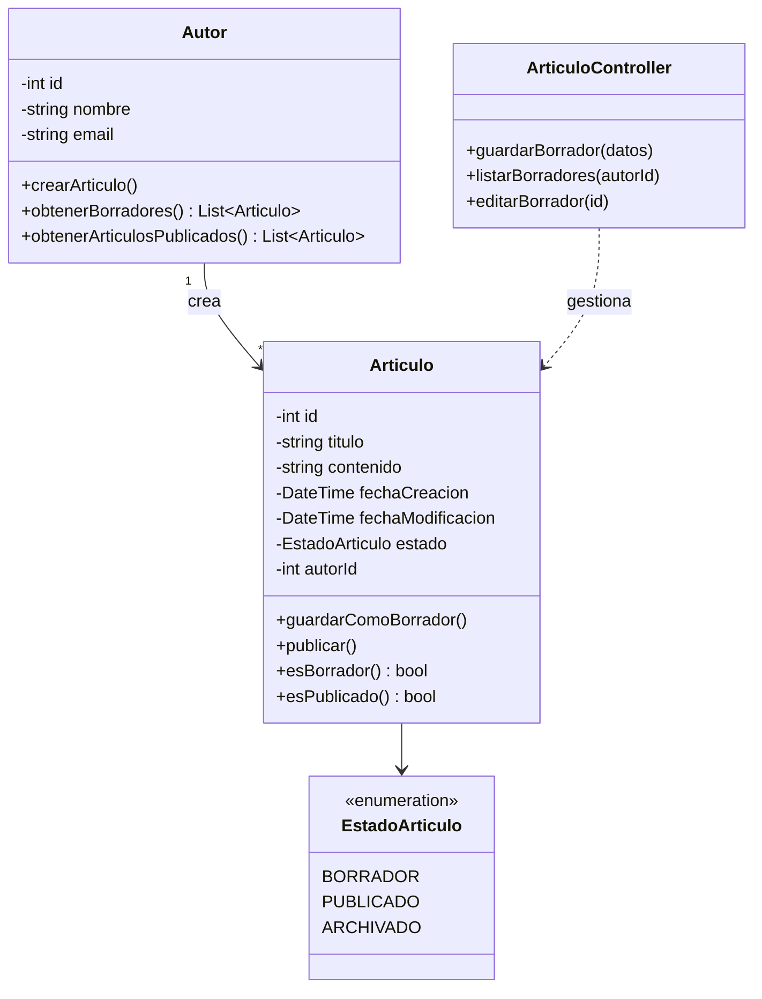
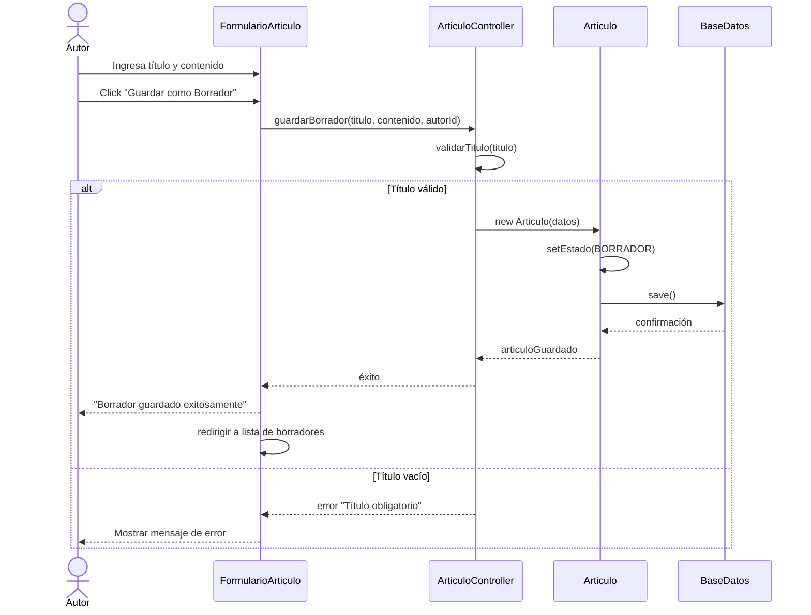
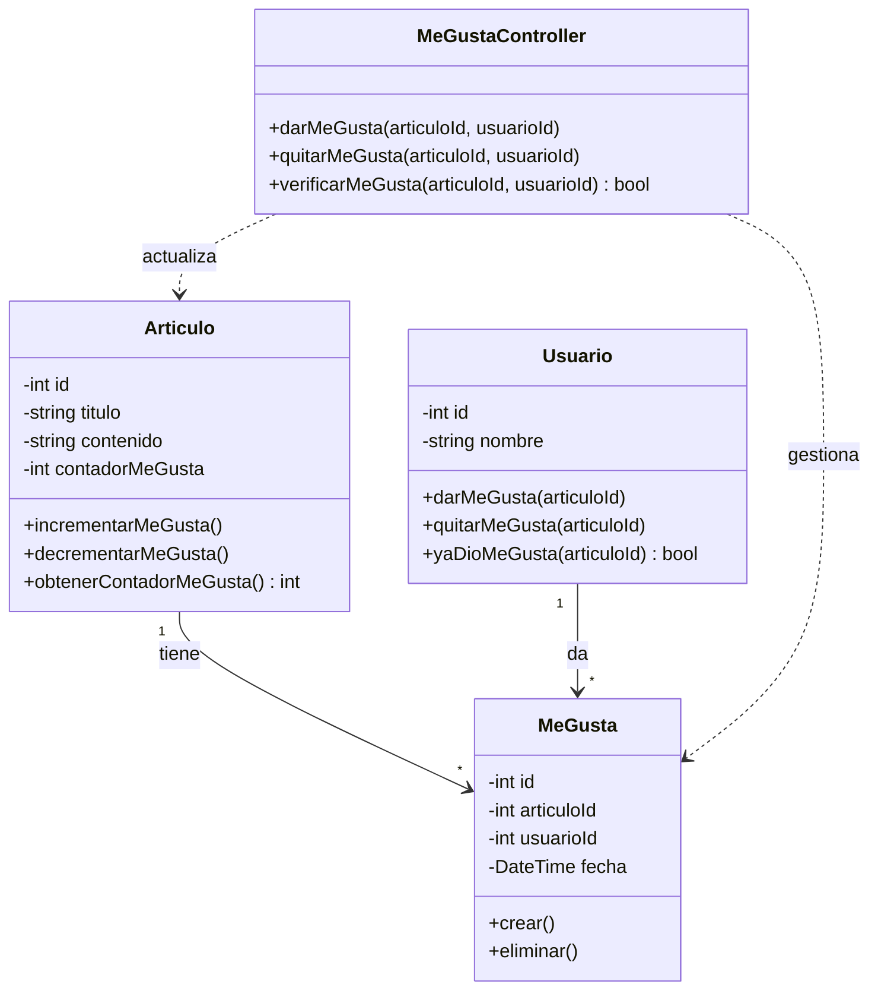
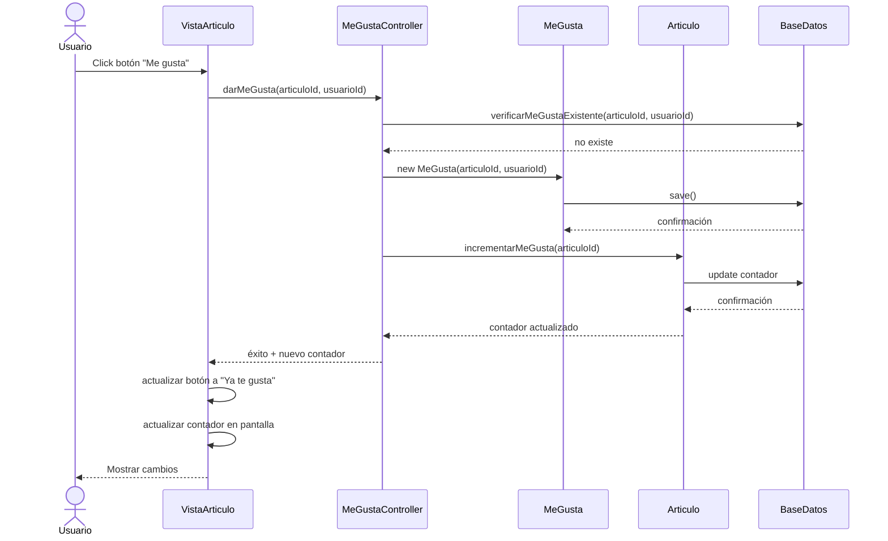
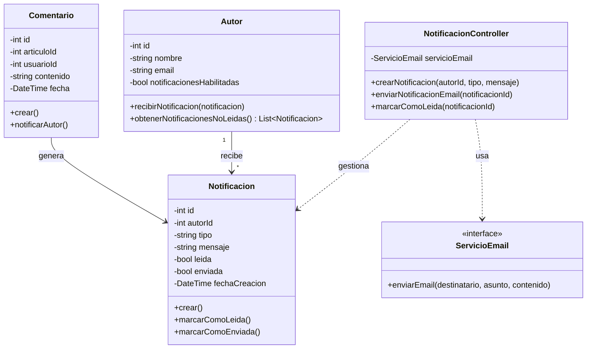
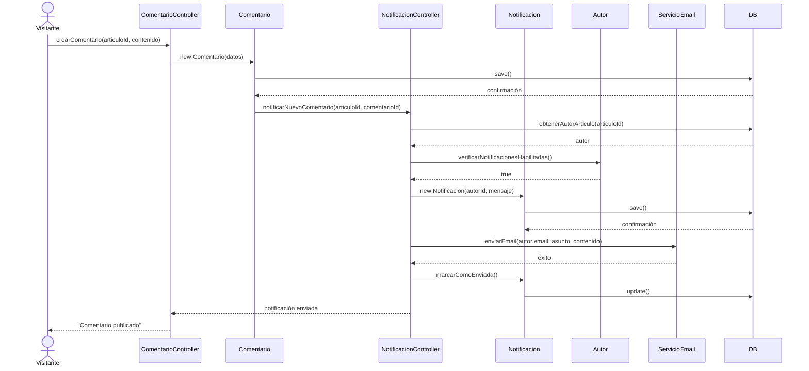

# Parte 2 del Examen: Ejemplos de Soluciones
**Tiempo:** 60 minutos  
**Puntaje:** 50% del examen final

---

## 📚 Propósito de este Documento

Este documento contiene **ejemplos de soluciones esperadas** para los 3 niveles de requisitos de la Parte 2. Sirve para:

1. **Estudiantes:** Orientarse sobre el nivel de detalle esperado
2. **Profesor:** Tener una referencia para evaluar

---

## 🎯 Opción A: Guardar Artículo como Borrador (Nivel Básico)

### Requisito
"Agregar funcionalidad de 'Guardar artículo como borrador' antes de publicar"

---

### 1. Caso de Uso Completo

#### CU-06: Guardar Artículo como Borrador

**Actor Principal:** Autor

**Actores Secundarios:** Sistema de Almacenamiento

**Descripción:**  
El autor puede guardar un artículo en estado de borrador para continuar editándolo más tarde antes de publicarlo.

**Precondiciones:**
- El autor debe estar autenticado en el sistema
- El autor debe tener permisos para crear artículos

**Flujo Principal:**
1. El autor accede al formulario de creación de artículo
2. El autor ingresa el título del artículo
3. El autor ingresa el contenido del artículo
4. El autor hace clic en el botón "Guardar como Borrador"
5. El sistema valida que el título no esté vacío
6. El sistema guarda el artículo con estado "borrador"
7. El sistema asigna fecha de creación y autor
8. El sistema muestra mensaje "Borrador guardado exitosamente"
9. El sistema redirige a la lista de borradores del autor
10. Fin del caso de uso

**Flujos Alternativos:**

**FA1: Título vacío**
- En el paso 5, si el título está vacío:
  - 5a. El sistema muestra mensaje "El título es obligatorio"
  - 5b. Retorna al paso 2

**FA2: Editar borrador existente**
- En el paso 1, si el autor accede a un borrador existente:
  - 1a. El sistema carga el título y contenido guardados
  - 1b. Continúa en paso 3

**FA3: Cancelar**
- En cualquier momento antes del paso 4:
  - El autor hace clic en "Cancelar"
  - El sistema pregunta "¿Descartar cambios?"
  - Si confirma: retorna a la lista de artículos
  - Si cancela: retorna al formulario

**Postcondiciones:**
- El artículo existe en la base de datos con estado "borrador"
- El artículo NO es visible públicamente
- El artículo aparece en la lista de borradores del autor
- Se registra la fecha de última modificación

**Excepciones:**
- Si hay error de conexión a la base de datos, el sistema muestra mensaje de error y no guarda el borrador

---

### 2. Diagrama de Clases

**Explicación:**
- **Articulo:** Se agrega atributo `estado` de tipo `EstadoArticulo`
- **EstadoArticulo:** Enumeración con estados posibles
- **Autor:** Métodos para gestionar borradores
- **ArticuloController:** Controlador con métodos para borradores

---

### 3. Diagrama de Secuencia

**Explicación:**
- Muestra el flujo completo desde la interacción del usuario
- Incluye validación y flujo alternativo
- Muestra interacción entre capas MVC
- Incluye persistencia en base de datos

---

## 🎯 Opción B: Sistema de "Me Gusta" (Nivel Intermedio)

### Requisito
"Implementar sistema de 'Me gusta' en artículos con contador visible"

---

### 1. Caso de Uso Completo

#### CU-07: Dar "Me Gusta" a un Artículo

**Actor Principal:** Visitante, Usuario Registrado

**Actores Secundarios:** Sistema de Almacenamiento

**Descripción:**  
Los usuarios pueden dar "me gusta" a un artículo para expresar que les gustó el contenido. El sistema lleva un contador de "me gusta" por artículo.

**Precondiciones:**
- El artículo debe estar publicado
- El usuario debe estar autenticado (opcional: permitir visitantes anónimos)

**Flujo Principal:**
1. El usuario visualiza un artículo publicado
2. El sistema muestra el botón "Me gusta" y el contador actual
3. El usuario hace clic en el botón "Me gusta"
4. El sistema verifica que el usuario no haya dado "me gusta" previamente
5. El sistema registra el "me gusta" asociado al usuario y artículo
6. El sistema incrementa el contador de "me gusta" del artículo
7. El sistema cambia el botón a estado "Ya te gusta" (deshabilitado)
8. El sistema actualiza el contador en la vista
9. Fin del caso de uso

**Flujos Alternativos:**

**FA1: Usuario ya dio "me gusta"**
- En el paso 4, si el usuario ya dio "me gusta":
  - 4a. El sistema muestra mensaje "Ya diste me gusta a este artículo"
  - 4b. No incrementa el contador
  - 4c. Fin del caso de uso

**FA2: Quitar "me gusta"**
- En el paso 3, si el botón está en estado "Ya te gusta":
  - 3a. El usuario hace clic para quitar el "me gusta"
  - 3b. El sistema elimina el registro de "me gusta"
  - 3c. El sistema decrementa el contador
  - 3d. El sistema cambia el botón a estado "Me gusta"
  - 3e. Fin del caso de uso

**FA3: Usuario no autenticado (opcional)**
- En el paso 3, si el usuario no está autenticado:
  - 3a. El sistema muestra mensaje "Debes iniciar sesión para dar me gusta"
  - 3b. El sistema redirige a la página de login
  - 3c. Fin del caso de uso

**Postcondiciones:**
- El "me gusta" queda registrado en la base de datos
- El contador del artículo se incrementa en 1
- El usuario no puede volver a dar "me gusta" al mismo artículo
- El cambio es visible inmediatamente para todos los usuarios

---

### 2. Diagrama de Clases

**Explicación:**
- **MeGusta:** Nueva clase para registrar cada "me gusta"
- **Articulo:** Agrega contador y métodos para incrementar/decrementar
- **Usuario:** Métodos para gestionar "me gusta"
- **MeGustaController:** Controlador específico para esta funcionalidad

---

### 3. Diagrama de Secuencia

---

## 🎯 Opción C: Sistema de Notificaciones (Nivel Avanzado)

### Requisito
"Agregar sistema de notificaciones: el autor recibe alerta cuando alguien comenta su artículo"

---

### 1. Caso de Uso Completo

#### CU-08: Notificar Autor sobre Nuevo Comentario

**Actor Principal:** Sistema (automatizado)

**Actores Secundarios:** Servicio de Email, Autor

**Descripción:**  
Cuando un visitante o usuario publica un comentario en un artículo, el sistema envía automáticamente una notificación al autor del artículo.

**Precondiciones:**
- El artículo debe estar publicado
- El autor debe tener email configurado
- El comentario debe haber sido guardado exitosamente

**Trigger (Disparador):**
- Se ejecuta automáticamente cuando se crea un nuevo comentario

**Flujo Principal:**
1. El sistema detecta que se creó un nuevo comentario
2. El sistema obtiene el artículo asociado al comentario
3. El sistema obtiene el autor del artículo
4. El sistema verifica que el autor tenga notificaciones habilitadas
5. El sistema crea una notificación en la base de datos
6. El sistema genera el contenido del email de notificación
7. El sistema envía el email al autor vía Servicio de Email
8. El sistema marca la notificación como "enviada"
9. Fin del caso de uso

**Flujos Alternativos:**

**FA1: Autor tiene notificaciones deshabilitadas**
- En el paso 4, si el autor deshabilitó las notificaciones:
  - 4a. El sistema registra la notificación pero no envía email
  - 4b. Fin del caso de uso

**FA2: Error al enviar email**
- En el paso 7, si falla el envío del email:
  - 7a. El sistema marca la notificación como "pendiente"
  - 7b. El sistema programa reintento en 5 minutos
  - 7c. Fin del caso de uso

**FA3: Autor comenta su propio artículo**
- En el paso 3, si el autor del comentario es el mismo que el autor del artículo:
  - 3a. El sistema no crea notificación
  - 3b. Fin del caso de uso

**Postcondiciones:**
- La notificación queda registrada en la base de datos
- El autor recibe un email con el nuevo comentario
- La notificación aparece en el panel del autor
- Se registra la fecha y hora de envío

---

### 2. Diagrama de Clases

---

### 3. Diagrama de Secuencia

---

## 📊 Criterios de Evaluación Aplicados

### Caso de Uso (20 puntos)

**Completitud (5 pts):**
- ✅ Todos los campos presentes (ID, actores, descripción, etc.)
- ✅ Formato correcto

**Claridad del Flujo (5 pts):**
- ✅ Pasos numerados y secuenciales
- ✅ Cada paso es claro y específico
- ✅ No hay ambigüedades

**Precondiciones/Postcondiciones (5 pts):**
- ✅ Precondiciones son estados necesarios
- ✅ Postcondiciones son estados finales verificables
- ✅ Son relevantes al caso de uso

**Flujos Alternativos (5 pts):**
- ✅ Al menos 2 flujos alternativos
- ✅ Cubren casos importantes (error, cancelación)
- ✅ Bien estructurados con retornos claros

### Diagrama de Clases (15 puntos)

**Clases Apropiadas (5 pts):**
- ✅ Clases necesarias identificadas
- ✅ Nombres descriptivos
- ✅ Responsabilidades claras

**Atributos y Métodos (5 pts):**
- ✅ Atributos relevantes con tipos
- ✅ Métodos principales identificados
- ✅ Encapsulación correcta (-, +)

**Relaciones (5 pts):**
- ✅ Relaciones correctas (asociación, composición, etc.)
- ✅ Cardinalidad apropiada
- ✅ Direccionalidad clara

### Diagrama de Secuencia (15 puntos)

**Objetos Correctos (5 pts):**
- ✅ Mínimo 4 objetos
- ✅ Objetos relevantes al flujo
- ✅ Incluye capas MVC

**Mensajes Apropiados (5 pts):**
- ✅ Mensajes claros y descriptivos
- ✅ Parámetros cuando son necesarios
- ✅ Respuestas indicadas

**Flujo Lógico (5 pts):**
- ✅ Orden temporal correcto
- ✅ Flujo completo de inicio a fin
- ✅ Incluye interacción con BD si aplica

---

## 💡 Consejos para Estudiantes

### Gestión del Tiempo (60 min)

- **20 min:** Caso de uso completo
- **20 min:** Diagrama de clases
- **20 min:** Diagrama de secuencia

### Prioridades

1. **Primero:** Caso de uso completo (vale más)
2. **Segundo:** Diagrama de clases (estructura)
3. **Tercero:** Diagrama de secuencia (flujo)

### Calidad sobre Cantidad

- Es mejor un caso de uso completo y bien hecho
- Que tres diagramas incompletos o confusos

---

**Nota:** Estos son ejemplos de referencia. Tu solución puede variar en detalles específicos, pero debe mantener este nivel de completitud y claridad.
