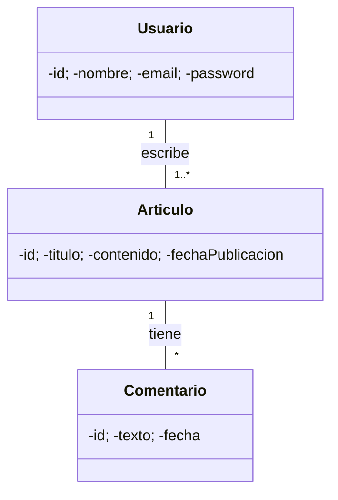

# Feedback PR #10 – VazAlexx (Clase 2)

Hola @VazAlexx 👋

Gracias por tu aporte: “agrego diagramas de clase, secuencia y actividad en clase 2”. Vi que mencionás también una clase `Administrador` para gestión de usuarios. Te dejo observaciones para alinear con el estándar del curso y mejorar el modelado.

## Fortalezas

- Aporte centrado en la Clase 2 (Clases, Secuencia y Actividad), muy en línea con la consigna.
- Enfoque completo: estructura (clases) + comportamiento (secuencia y actividad).
- Buen uso de listas numeradas y mensajes claros en el texto (según el diff).

## Mejoras sugeridas (estándar del repo)

### 1) Ubicación y formato

- Si los cambios están en `clase-2-diagramas-uml.md`, mantené el bloque de cada diagrama con encabezados (`## Diagrama de Clases`, `## Diagrama de Secuencia`, `## Diagrama de Actividad`).
- Para diagramas en texto, preferimos Mermaid en Markdown (evita depender de imágenes externas). Por ejemplo:

- Si subís imágenes, agregá también la fuente `.drawio` y ubicá ambos en una carpeta (`diagramas/` o `clase-2/diagramas/`). Nombres en minúsculas y sin espacios: `diagrama-clases.drawio` / `diagrama-clases.png`.

### 2) Sobre la clase “Administrador”

- Diseño: evaluá si “Administrador” conviene modelarlo como una especialización de `Usuario` (herencia) o como un rol/perfil (atributo `rol` en `Usuario`).
- Recomendación: si el “Administrador” no agrega atributos/métodos propios significativos y solo representa permisos, preferimos modelarlo como rol/permiso (bajo acoplamiento, evita clases innecesarias). Si sí aporta comportamiento/estado propio, justificá la herencia `Usuario <|-- Administrador`.
- Multiplicidades: si se mantiene como clase, definí relaciones (p. ej., `Administrador` gestiona `Usuario*`) y anotá responsabilidades.

### 3) Diagrama de Secuencia

- Usa participantes explícitos: `:VistaArticulo`, `:ArticuloController`, `:Articulo`, `:Comentario` (o los que correspondan al flujo elegido).
- Mensajes con intención: `crearArticulo(datos)`, `guardar()`, `validar()`, etc.; preferí evitar mensajes genéricos.
- Si aparece creación de objetos, marcá `create` y el punto donde sucede.

### 4) Diagrama de Actividad

- Asegurá nodos de decisión para validaciones (`¿datos válidos?`) y nombres de acciones claros.
- Camino feliz numerado y flujos alternativos con etiquetas (2a., 4a.) como en los ejemplos del repo.

### 5) Convenciones del repositorio

- Encabezados consistentes, una línea en blanco entre secciones y `newline` al final del archivo.
- Nombres de archivo en minúsculas, con guiones, sin espacios.
- Commits y título del PR con Conventional Commits (p. ej., `docs: agrega diagramas de clase/secuencia/actividad (clase 2)`).

## Checklist de acciones

- [ ] Consolidar los diagramas en secciones con encabezado dentro de `clase-2-diagramas-uml.md` (o enlazar a carpeta `clase-2/diagramas/`).
- [ ] Si hay imágenes, subir `.drawio` y renombrar archivos sin espacios.
- [ ] Mermaid preferido para diagramas en Markdown cuando sea posible.
- [ ] Justificar “Administrador” (rol vs. herencia) y reflejarlo en el diagrama de clases.
- [ ] Afinar participantes y mensajes del diagrama de secuencia.
- [ ] Verificar decisiones y flujos alternativos en el diagrama de actividad.

## Nota educativa

Este repo es de práctica; los PR quedan abiertos para evaluación (no hace falta mergear por cuenta propia). Política: <https://github.com/IES9018/proyecto-modelado-2025/discussions/6>

Buen trabajo, Alex. Con estos ajustes, tu aporte queda sólido y alineado con el estándar del curso. 🚀

Profesor Paulo
