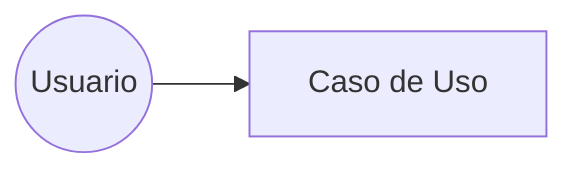

# 📝 Feedback PR #24 - Camila Scheurer (@Milasch23)

## 🎯 Resumen General

**¡Excelente entrega final, Camila!** 🌟

Este PR representa una **entrega completa y profesional** de todo el proyecto (Clases 1-4). Has demostrado un dominio sólido de:
- ✅ Diagramas UML (Casos de Uso, Clases, Secuencia, Actividad)
- ✅ Arquitectura MVC y principios de diseño
- ✅ Versionado y personalización del proyecto
- ✅ Documentación clara y estructurada

**Tu feature único "CamilaBlog"** con sistema de likes, categorías, etiquetas, borradores y estadísticas es muy completo y está bien modelado.

---

## ✅ Fortalezas Identificadas

### 1. **Diagramas Mermaid de Alta Calidad**
- Diagramas de clases, secuencia y actividad bien estructurados
- Sintaxis Mermaid correcta y renderizable
- Relaciones entre clases claramente definidas
- Múltiples diagramas de secuencia para diferentes casos de uso

### 2. **Arquitectura MVC Bien Documentada**
- Diagrama conceptual del patrón MVC claro
- Separación correcta de responsabilidades
- Aplicación del patrón Facade explicada

### 3. **Feature Único Completo**
- 6 funcionalidades nuevas modeladas:
  - Likes (Me gusta)
  - Categorías mejoradas (slug + descripción)
  - Etiquetas (tags)
  - Borradores / publicación diferida
  - Panel de estadísticas
  - Gestión de usuarios (roles)
- Casos de uso detallados (13 CU en total)
- Diagrama de clases extendido con nuevas entidades

### 4. **README Profesional**
- Personalización completa (CamilaBlog v1.0.0)
- Branding propio con emojis
- Descripción clara del fork y diferenciación

### 5. **Aplicación de Principios de Diseño**
- Alta Cohesión y Bajo Acoplamiento explicados
- Refactorización del diagrama de clases documentada
- Patrón Facade con justificación y beneficios

---

## 🔍 Observaciones y Áreas de Mejora

### ⚠️ Crítico: Archivos Fuente Faltantes

**Problema:** No se incluyen archivos `.drawio` o `.drawio.png` fuente de los diagramas.

**¿Por qué es importante?**
- Los diagramas Mermaid están en texto (✅ bien), pero si creaste diagramas en Draw.io/diagrams.net, debes subir los archivos fuente
- Esto permite ediciones futuras sin tener que recrear todo desde cero
- Es parte de las buenas prácticas de documentación técnica

**Solución:**
Si usaste diagrams.net para crear bocetos o versiones previas:
```bash
# En tu fork, agrega los archivos fuente
git add diagramas/*.drawio
git commit -m "docs: agregar archivos fuente .drawio de diagramas"
git push origin tu-rama
```

### 📝 Convenciones de Nombres de Archivos

**Observación:** Tienes archivos con nombres mixtos:
- ✅ `clase2Diagramas.md` (camelCase)
- ✅ `clase3Actividad.md` (camelCase)
- ✅ `clase4.md` (lowercase)

**Recomendación:** Usa consistentemente `kebab-case`:
- `clase-2-diagramas.md`
- `clase-3-actividad.md`
- `clase-4-implementacion.md`

### 🔚 Newline al Final de Archivos

Verifica que todos los archivos `.md` terminen con una línea vacía (newline):
```markdown
# Última línea de contenido

```

Esto es una convención POSIX que evita warnings en Git.

### 📂 Organización de Archivos

**Sugerencia:** Podrías organizar mejor los archivos:

```
proyecto-modelado-2025/
├── README.md
├── casos-de-uso/
│   └── casos-uso-camila-blog.md
├── diagramas/
│   ├── clase-2-diagramas.md
│   ├── clase-3-actividad.md
│   └── clase-4-implementacion.md
└── docs/
    └── arquitectura-mvc.md
```

### 📊 CHANGELOG.md y Versionado

**Faltante:** No veo un archivo `CHANGELOG.md` actualizado para CamilaBlog.

**Recomendación:** Crea un CHANGELOG siguiendo [Keep a Changelog](https://keepachangelog.com/):

```markdown
# Changelog - CamilaBlog

## [1.0.0] - 2025-11-18

### Added
- Sistema de likes para artículos
- Categorías con slug y descripción
- Etiquetas (tags) para organización
- Sistema de borradores
- Panel de estadísticas
- Gestión de usuarios por roles

## [0.1.0] - 2025-11-05
### Added
- Fork inicial de Institución Digital
- Diagramas base (Clases 1-3)
```

### 🎨 Diagramas Mermaid - Sugerencias de Formato

En `clase4.md`, algunos diagramas podrían mejorar:

**Diagrama de Caso de Uso (línea 6):**
```mermaid
flowchart TD
```
💡 **Tip:** Para casos de uso, considera usar la sintaxis específica de Mermaid:


**Diagrama de Clases (línea 55):**
El diagrama está muy completo. Considera agregar multiplicidades más específicas si aplica:
```mermaid
Articulo "1" --> "0..1" Estadistica : genera
```

---

## 📋 Checklist de Acción

Antes de la evaluación final, te sugiero:

- [ ] **Agregar archivos `.drawio` fuente** (si los tienes)
- [ ] **Crear `CHANGELOG.md`** siguiendo Keep a Changelog
- [ ] **Renombrar archivos a kebab-case** para consistencia
- [ ] **Verificar newline** al final de todos los `.md`
- [ ] **Considerar reorganizar** en carpetas temáticas
- [ ] **Revisar que el README** referencie todos los archivos nuevos
- [ ] **Opcional:** Agregar badges al README (licencia, versión)

---

## 🎓 Evaluación Preliminar

| Aspecto | Puntuación | Observaciones |
|---------|-----------|---------------|
| **Clase 1** (Casos de Uso) | ⭐⭐⭐⭐⭐ | 13 casos de uso bien definidos |
| **Clase 2** (Diagramas UML) | ⭐⭐⭐⭐⭐ | Clases, secuencia, actividad completos |
| **Clase 3** (Arquitectura) | ⭐⭐⭐⭐⭐ | MVC, Facade, refactorización documentada |
| **Clase 4** (Versionado) | ⭐⭐⭐⭐☆ | README personalizado, falta CHANGELOG |
| **Feature Único** | ⭐⭐⭐⭐⭐ | Sistema completo de categorías/likes/estadísticas |
| **Documentación** | ⭐⭐⭐⭐☆ | Excelente, mejoraría con .drawio |
| **Git/Commits** | ⭐⭐⭐⭐☆ | PR limpio, podrían mejorar nombres de archivos |

**Calificación Estimada:** **9.5/10** 🎉

---

## 📚 Recursos Útiles

- [Keep a Changelog](https://keepachangelog.com/es-ES/1.0.0/)
- [Semantic Versioning](https://semver.org/lang/es/)
- [Mermaid Live Editor](https://mermaid.live/) - Para testear tus diagramas
- [Draw.io](https://app.diagrams.net/) - Para diagramas fuente

---

## 💬 Comentarios Finales

Camila, este es un **trabajo excepcional**. Has integrado todos los conceptos del curso de manera coherente y profesional. Tu sistema CamilaBlog es ambicioso pero realista, y la documentación es clara.

Las observaciones son menores y no afectan la calidad fundamental de tu entrega. Con los ajustes sugeridos, este proyecto podría servir como **referencia para futuros estudiantes**.

**¡Felicitaciones por el esfuerzo y dedicación!** 👏

---

**Fecha de revisión:** 18 de noviembre de 2025  
**Revisor:** Paulo Alvarez  
**Estado:** Aprobado con sugerencias menores
